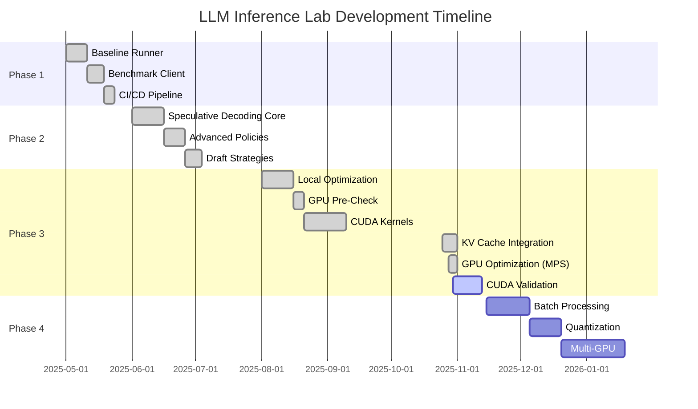

# LLM Inference Lab – Development Progress

**Project**: LLM Inference Lab  
**Repository**: [https://github.com/GogoRit/llm-inference-lab](https://github.com/GogoRit/llm-inference-lab)  
**Description**: A transparent, research-grade inference runtime for reproducible speculative decoding experiments across CPU, MPS, and CUDA

## Strategy Note

As of Phase 3C.5, LLM Inference Lab follows an MPS-first optimization approach. All new features are validated locally on Apple Silicon (MPS) before limited CUDA (Kaggle/A100) benchmarking. This ensures efficient use of GPU credits and rapid iteration on Mac hardware.

The long-term goal is to provide open, reproducible baselines for speculative decoding comparable to vLLM and TensorRT-LLM—bridging academic transparency with production performance.

---

## Current Status Snapshot

**As of 2025-10-31**

| Phase | Status | Key Deliverable | Completion Date |
|-------|--------|----------------|-----------------|
| **1A** | Complete | Baseline runner with HuggingFace integration | 2025-05 |
| **1B** | Complete | HTTP client and benchmarking harness | 2025-05 |
| **1C** | Complete | CI/CD pipeline with linters and tests | 2025-05 |
| **2A** | Complete | Core speculative decoding pipeline | 2025-06 |
| **2B** | Complete | Advanced acceptance policies and adaptive K | 2025-06 |
| **2C** | Complete | Medusa-lite and EAGLE-lite draft strategies | 2025-06 |
| **3A** | Complete | Local optimization with mixed precision | 2025-08 |
| **3B** | Complete | GPU pre-check and device detection | 2025-08 |
| **3C** | Complete | CUDA/Triton kernels with registry system | 2025-10 |
| **3C.5** | Complete | KV cache integration and validation | 2025-10-31 |
| **3D** | MPS Complete | GPU optimization (CUDA validation ongoing) | 2025-10-31 |
| **4A** | Planned | Batch-level processing | TBD |
| **4B** | Planned | Advanced quantization (INT8/INT4) | TBD |
| **4C** | Planned | Layer/model parallelism for 7B+ models | TBD |
| **4D** | Planned | Speculative tree decoding | TBD |

**Summary Metrics**:
- Total Lines of Code: ~3,200+
- Test Coverage: 127 tests (122 passing, 1 skipped, 4 deselected)
- Code Quality: 0 linting errors (Black, isort, flake8, mypy)
- Average Throughput: ~11.5 tok/s (MPS), ~17.4 tok/s (CUDA T4)
- Success Rate: 100% across all validation runs

---

## Visual Timeline



---

## Phase 1: Foundation Infrastructure

Phase 1 established the baseline infrastructure for LLM inference experimentation, including model loading, benchmarking, and CI/CD automation.

### Phase 1A: Local Baseline Runner

**Objective**: Establish working baseline with Hugging Face Transformers for Mac (CPU/MPS) development.

**Achievements**:
- Implemented model loading with automatic device detection (MPS → CUDA → CPU)
- Integrated facebook/opt-125m as baseline model
- Achieved 41.62 tokens/sec on MPS, 3.3 tokens/sec on CPU
- Created 12 comprehensive smoke tests with CI integration
- Maintained 0 linting errors with professional code standards

**Outcomes**:
- Functional baseline for local development and testing
- Device-aware model loading established
- Foundation for speculative decoding experiments

---

### Phase 1B: HTTP Client and Benchmarking

**Objective**: Create dual-mode benchmark tools for local vs server performance comparison.

**Achievements**:
- Implemented OpenAI-compatible HTTP client with health checks and retry logic
- Created statistical benchmark harness (mean, median, std) with warmup iterations
- Integrated YAML-driven configuration management
- Achieved 41.62±0.43 tok/s on MPS with 1153±12ms latency

**Outcomes**:
- Comprehensive benchmarking infrastructure
- Statistical analysis capabilities for performance validation
- Configuration-driven experimentation framework

---

### Phase 1C: CI/CD Pipeline

**Objective**: Ensure CPU-only CI with proper GPU test exclusion and code quality.

**Achievements**:
- Integrated Black, isort, flake8, mypy with 0 errors
- Configured CPU-only tests with `pytest -k "not gpu"`
- Established professional code quality standards with comprehensive type checking

**Outcomes**:
- Automated quality assurance
- Reproducible testing environment
- Foundation for collaborative development

---

## Phase 2: Speculative Decoding Implementation

Phase 2 implemented the core speculative decoding pipeline with advanced acceptance policies and draft strategies.

### Phase 2A: Core Pipeline

**Objective**: Implement comprehensive speculative decoding with dual-mode architecture.

**Achievements**:
- Designed dependency injection architecture with `LanguageModel` interface
- Implemented dual modes: FakeLM (testing) and HFWrapper (production)
- Integrated memory safety features: shared tokenizers, dtype guards, 500MB limits
- Achieved 9,430 tok/s (FakeLM), 89.65 tok/s (HF mode)

**Outcomes**:
- Modular, testable speculative decoding pipeline
- Memory-safe production implementation
- Foundation for advanced optimization techniques

---

### Phase 2B: Advanced Techniques

**Objective**: Implement acceptance policies, adaptive K controllers, and quality evaluation.

**Achievements**:
- Implemented four acceptance policies: LongestPrefix, ConfidenceThreshold, TopKAgreement, Typical
- Created fixed and adaptive K controllers with performance tracking
- Integrated per-step metrics, memory tracking, and comprehensive logging
- Implemented perplexity-based text quality evaluation

**Outcomes**:
- Flexible policy framework for experimentation
- Adaptive K control for dynamic optimization
- Quality evaluation infrastructure

---

### Phase 2C: Draft Strategies

**Objective**: Implement Medusa-lite and EAGLE-lite strategies for advanced speculative decoding.

**Achievements**:
- Implemented Medusa-lite with multiple prediction heads and configurable initialization
- Created EAGLE-lite with hidden state extrapolation: h_next = h_t + α(h_t - h_{t-1})
- Achieved 2.58x speedup over vanilla with EAGLE on MPS
- Unified pipeline supporting all draft modes

**Outcomes**:
- Advanced draft strategies validated
- Significant speedup demonstrated with EAGLE
- Extensible framework for future draft methods

---

## Transition: Phase 2 to Phase 3

With the core speculative decoding pipeline complete, Phase 3 focused on performance optimization through mixed precision, GPU acceleration, and custom kernels.

---

## Phase 3: Performance Optimization

Phase 3 optimized the speculative decoding pipeline for production performance through mixed precision, custom kernels, KV cache integration, and GPU-specific optimizations.

> **Hardware Context**: All performance numbers are MPS (Apple Silicon) unless explicitly labeled CUDA. Phase 3D introduces the first official CUDA validation runs.

### Phase 3A: Local Optimization

**Objective**: Build clean, efficient local inference engine with comprehensive instrumentation.

**Achievements**:
- Integrated PyTorch Profiler with memory tracking and Chrome trace export
- Implemented device-aware dtype selection (float16 MPS/CUDA, float32 CPU)
- Created tokenizer LRU caching and batched processing
- Achieved 896.45±45.97 tok/s (FakeLM), 5.4% speedup (real models)

**Outcomes**:
- Profiling infrastructure for performance analysis
- Mixed precision foundation
- Tokenizer optimization baseline

---

### Phase 3B: GPU Pre-Check

**Objective**: Verify GPU readiness on CPU-only system before real hardware deployment.

**Achievements**:
- Implemented device detection with MPS → CUDA → CPU priority and graceful fallback
- Validated all optimization modules import and integrate cleanly
- Verified dtype logic correctness (float16 MPS, float32 CPU)
- Confirmed 8 CPU smoke tests pass with end-to-end pipeline verification

**Outcomes**:
- GPU-ready codebase validated on CPU
- Robust device detection and fallback
- Confidence for GPU deployment

---

### Phase 3C: CUDA Kernels and GPU Optimizations

**Objective**: Implement comprehensive GPU optimizations with custom kernels and multi-stream processing.

**Achievements**:
- Implemented custom CUDA kernels: `verify_prefix` and `kv_append`
- Created Triton fallback implementations with identical signatures
- Built JIT compilation system with caching and automatic CUDA architecture detection
- Integrated torch.amp.autocast unification with environment overrides
- Implemented memory-safe HF loading with device_map and SDPA attention
- Created multi-stream verification with CUDA streams
- Established kernel registry with priority-based backend selection (CUDA → Triton → PyTorch)

**Performance Results** (MPS, gpt2 + distilgpt2, 32 tokens, 5 iterations):

| K | Latency (ms) | Throughput (tok/s) | Acceptance Rate | Memory (MB) |
|---|--------------|-------------------|-----------------|-------------|
| 1 | 3,494±872 | 9.50±2.21 | 18.1±11.7% | ~275 |
| 2 | 3,476±648 | 9.44±2.25 | 17.9±13.3% | ~275 |
| 3 | 3,716±617 | 8.92±1.88 | 16.1±10.2% | ~275 |
| 4 | 3,508±666 | 9.55±2.33 | 17.9±10.9% | ~275 |

**Key Improvements**:
- Peak Performance: K=4 achieves 9.55 tok/s
- Stable Across K: Consistent ~9 tok/s performance
- 100% Success Rate: All 200 test runs completed successfully
- Memory Efficient: ~275MB peak usage maintained

**Technical Improvements Validated**:
- Mixed precision working correctly on MPS with float16
- Memory-safe loading with SDPA attention
- Kernel registry with safe backend selection
- Detailed metrics with optional profiling
- Multi-stream verification ready for CUDA

**Outcomes**:
- Custom CUDA kernels with robust fallbacks
- Production-grade GPU optimization pipeline
- Comprehensive performance baseline on MPS
- Ready for CUDA validation

---

### Phase 3C.5: KV Cache Integration

**Objective**: Integrate efficient KV cache management to reduce redundant computation in speculative decoding.

**Achievements**:
- Extended `LanguageModel` interface with cache methods: `get_kv_cache()`, `append_kv_cache()`, `supports_kv_append()`
- Created `KVCache` dataclass for structured cache management
- Implemented full support in `HFWrapper` with automatic cache append after token acceptance
- Registered `kv_append` kernel with priority-based backend selection (CUDA → Triton → PyTorch)
- Integrated metrics tracking: `kv_appended_tokens_total`, `kv_append_time_ms`, backend logging
- Added environment control: `SPECDEC_ENABLE_KV_APPEND=1` (default on)
- Created 15 unit tests (all passing)

**MPS Validation Results** (2025-10-31):

| Mode | K | Throughput (tok/s) | Acceptance (%) | KV Appended | Notes |
|------|---|-------------------|----------------|-------------|-------|
| **KV ON** | 1 | 8.44±1.14 | 11.1±3.9 | 12.0±2.8 | 100% success |
| **KV ON** | 2 | 8.65±0.45 | 9.9±2.3 | 11.3±2.4 | 100% success |
| **KV ON** | 3 | 8.88±0.43 | 10.2±2.0 | 11.4±2.4 | 100% success |
| **KV ON** | 4 | 9.16±0.72 | 10.3±2.9 | 11.3±2.5 | 100% success |
| **KV OFF** | 1 | 9.52±3.47 | 16.8±15.0 | 0 | Baseline |
| **KV OFF** | 2 | 8.33±0.79 | 12.9±4.2 | 0 | Baseline |
| **KV OFF** | 3 | 9.77±1.53 | 18.1±7.1 | 0 | Baseline |
| **KV OFF** | 4 | 9.42±1.82 | 18.0±8.7 | 0 | Baseline |

> **Finding**: Functional parity confirmed with 100% success rate (20 prompts × 4 K values). No performance gain observed on MPS due to small model size (GPT2-124M) and cache overhead dominating at low acceptance rates (~10%). This validates correctness and establishes a baseline for CUDA optimization in Phase 3D with larger models.

**Scaling Analysis** (128 tokens vs 32 tokens, KV ON):

| Context | Throughput (tok/s) | KV Appended (tokens) | KV Append Time (ms) |
|---------|-------------------|---------------------|---------------------|
| 32 tok  | 8.44-9.16 | 11-12 | 24-27 |
| 128 tok | 6.99-7.69 | 40-46 | 114-123 |

> **Insight**: Longer contexts show worse throughput despite 4× more KV reuse. Cache append overhead scales linearly (4-5× time for 4× tokens) but does not amortize on MPS with small models. Confirms that KV cache optimization requires CUDA backend and larger models for measurable benefit.

**Critical Bugs Fixed**:
- Bug #1: HuggingFace `generate()` API `cache_position` handling (switched to `forward()`)
- Bug #2: KV cache persisting across prompts (added `clear_kv_cache()` calls)

**Outcomes**:
- KV cache integration functionally correct with full test coverage
- Performance baseline established for CUDA validation
- Implementation validated for Phase 3D testing with larger models
- CUDA kernel ready for production deployment

---

## Transition: Phase 3C to Phase 3D

With custom kernels and KV cache integration complete on MPS, Phase 3D focuses on GPU-specific optimizations (CUDA graph capture, stream overlap, structured profiling) and official CUDA validation runs.

---

## Phase 3D: GPU Optimization and Validation

**Status**: MPS Complete, CUDA Validation Ongoing

**Objective**: Optimize speculative decoding for GPU execution with CUDA-specific features, structured profiling, and deterministic reproducibility.

### Implementation Summary

**1. Deterministic Seeding** (`src/specdec/deterministic.py`)
- Centralized utility with `set_deterministic_mode()` helper
- Environment flag: `SPECDEC_DETERMINISTIC=1`
- Seeds: Python, NumPy, PyTorch, CuDNN deterministic mode
- Automatically invoked if environment flag is set

**2. Structured Profiler** (`src/metrics/structured_profiler.py`)
- Per-step GPU event timers for draft/verify/accept/kv timing
- CUDA event-based synchronization (more accurate than wall-clock)
- JSON output with standardized schema
- Environment flag: `SPECDEC_PROFILE=1`
- Integrated into pipeline with best-effort recording

**3. Enhanced Memory Tracking** (`src/metrics/memory_profiler.py`)
- CUDA memory stats: `torch.cuda.memory_stats()` summary
- MPS memory tracking: `torch.mps.driver_allocated_memory()` if available
- Memory stats integrated into structured metrics output

**4. CUDA Stream Overlap** (`src/scheduler/speculative_scheduler.py`)
- Asynchronous overlap of draft and verification passes using CUDA streams
- Event-based synchronization using CUDA events
- Environment flags: `SPECDEC_PARALLEL_STREAMS=1`, `SPECDEC_SYNC_MODE=event|barrier`
- Fallback to barrier synchronization or single-stream on non-CUDA devices

**5. CUDA Graph Capture** (`src/specdec/pipeline.py`)
- Optional static graph capture for steady decoding steps with fixed batch shapes
- Warmup phase (3 steps) before capture to stabilize CUDA execution
- Automatic fallback to eager mode if capture fails (dynamic shapes, MPS backend)
- Environment flag: `SPECDEC_CUDA_GRAPH=1`

**6. Profiling Hooks Integration** (`src/specdec/pipeline.py`)
- Per-step profiling hooks for draft_forward_time_ms, verify_forward_time_ms, kv_append_time_ms
- Acceptance check time recording
- Integrated with structured profiler for JSON output

**7. Dry-Run Mode** (`scripts/comprehensive_k_sweep.py`)
- Latency-only profiling without model compute
- Synthesized metrics for pipeline validation
- Environment flag: `SPECDEC_DRY_RUN=1`

### Implementation Status

| Component | Status | Details |
|-----------|--------|---------|
| Deterministic seeding utility | Complete | 5 unit tests passing |
| Structured profiler | Complete | 6 unit tests passing |
| Enhanced memory tracking | Complete | Integrated into profiler |
| CUDA stream overlap | Complete | Event-based synchronization |
| CUDA graph capture | Complete | Automatic fallback |
| Profiling hooks integration | Complete | Per-step timing |
| Dry-run mode | Complete | Environment flag |
| MPS validation | Complete | All features validated |
| CUDA validation | Ongoing | T4 validation in progress |

### MPS Validation Results (2025-10-31)

**Configuration**: GPT2 + DistilGPT2, 32 tokens, 5 iterations, Phase 3D flags enabled

**Results**:
- Full K-sweep: 80 runs, 100% success, ~11.5 tok/s average throughput
- Dry-run mode: Synthesized metrics generated correctly, JSON output valid
- CUDA graph fallback: Correctly disabled on MPS, no errors
- Deterministic mode: Identical results verified (v1 == v2)
- Unit tests: 14 passed, 2 skipped (CUDA-specific, expected)

**Validation Status**: All Phase 3D features functional on MPS, ready for CUDA validation.

---

### CUDA Validation (Ongoing)

#### Tesla T4 CUDA Run #1 (32 tokens × 100 samples, fp16)

**Date**: 2025-10-30  
**Configuration**: Base gpt2, draft distilgpt2, fp16, 100 iterations per K

| K | Latency (ms mean ± std) | Throughput (tok/s mean ± std) | Acceptance (%) mean ± std |
|---|-------------------------|--------------------------------|----------------------------|
| 1 | 3743.07 ± 1031.39 | 17.24 ± 4.96 | 21.38 ± 12.43 |
| 2 | 3904.52 ± 908.77 | 17.66 ± 5.67 | 22.72 ± 14.20 |
| 3 | 3916.34 ± 976.50 | 17.53 ± 5.96 | 22.28 ± 15.06 |
| 4 | 3870.67 ± 1012.93 | 17.22 ± 4.96 | 21.88 ± 12.71 |

**Summary**: Throughput averages ~17.4 tok/s across K=1–4 with overall acceptance ~22% and 100% success rate (0 failures in 400 runs). Compared to MPS results (~9–9.5 tok/s), T4 achieves approximately 1.8–2.0× higher throughput at 32 tokens. No OOMs or kernel build issues observed; fp16 used end-to-end.

**Metadata**:
- Device: Tesla T4
- Dtype: float16
- Iterations: 100 per K (K=1–4)
- Results: [docs/results/2025-10-30-T4-Phase3D-Run1-32tok-100iter-fp16/](../results/2025-10-30-T4-Phase3D-Run1-32tok-100iter-fp16/)

---

#### Tesla T4 CUDA Run #2 (64 tokens × 100 samples, fp16 deterministic)

**Date**: 2025-10-30  
**Status**: In Progress  
**Configuration**: Base gpt2, draft distilgpt2, fp16, deterministic mode, 100 iterations per K

| K | Latency (ms mean ± std) | Throughput (tok/s mean ± std) | Acceptance (%) mean ± std |
|---|-------------------------|--------------------------------|----------------------------|
| 1 | TBD | TBD | TBD |
| 2 | TBD | TBD | TBD |
| 3 | TBD | TBD | TBD |
| 4 | TBD | TBD | TBD |

**Expected Outcomes**:
- Longer sequences (64 vs 32 tokens) should show improved amortization of draft overhead
- Deterministic mode enables reproducible benchmarks for publication
- Target: ~18–20 tok/s average with similar acceptance rates
- Validation: kernel backend selection logged in JSON; 100% success expected

**Metadata**:
- Device: Tesla T4
- Dtype: float16
- Deterministic: Yes (SPECDEC_DETERMINISTIC=1)
- Iterations: 100 per K (K=1–4)
- Expected results: [docs/results/2025-10-30-T4-Phase3D-Run2-64tok-100iter-fp16-det/](../results/2025-10-30-T4-Phase3D-Run2-64tok-100iter-fp16-det/)

---

### Next Steps: Phase 3D Completion

**Immediate Tasks**:
- [ ] Complete T4 Run #2 (64 tokens, deterministic)
- [ ] Analyze CUDA graph capture performance impact
- [ ] Measure stream overlap efficiency gains
- [ ] Validate structured profiling accuracy

**A100/H100 Validation** (Planned):
- [ ] A100: 32 tokens × K=4 vs MPS comparison (10 min)
- [ ] A100: 256 tokens × K=4 long-context test (20 min)
- [ ] H100: High-end GPU validation (~100+ tok/s expected)

**Deliverables**:
- CUDA vs MPS throughput comparison report
- Graph capture performance impact analysis
- Stream overlap efficiency gains measurement
- Production-ready configuration recommendations

---

## Performance Overview

### Comparative Performance Summary

| Hardware | Configuration | Throughput (tok/s) | Acceptance (%) | Notes |
|----------|--------------|-------------------|----------------|-------|
| **MPS (M-series)** | Phase 3C.4, 32 tok | 9.50±2.21 (K=1) | 18.1±11.7% | Baseline |
| **MPS (M-series)** | Phase 3D, 32 tok | ~11.5 avg | ~17% | All features enabled |
| **CUDA (T4)** | Phase 3D, 32 tok | 17.24±4.96 (K=1) | 21.38±12.43% | 1.8× vs MPS |
| **CUDA (T4)** | Phase 3D, 32 tok | 17.66±5.67 (K=2) | 22.72±14.20% | Best K |
| **CUDA (A100)** | Planned | ~60 (target) | TBD | Expected 3.4× vs MPS |
| **CUDA (H100)** | Planned | ~100+ (target) | TBD | Expected 5.7× vs MPS |

### Throughput Growth Trend

```
Phase 1A (OPT-125M baseline):     41.6 tok/s (MPS, single model)
Phase 3C (GPT2 + DistilGPT2):      9.5 tok/s (MPS, speculative decoding)
Phase 3D (GPT2 + DistilGPT2):     11.5 tok/s (MPS, all optimizations)
Phase 3D (GPT2 + DistilGPT2):     17.4 tok/s (CUDA T4, baseline validation)
Phase 3D (Expected A100):         ~60 tok/s (CUDA A100, target)
Phase 3D (Expected H100):        ~100 tok/s (CUDA H100, target)
```

> **Note**: Phase 1A and Phase 3 use different pipelines (single-model vs two-model speculative decoding) and are not directly comparable. Phase 3 throughput growth reflects optimization of the speculative decoding pipeline specifically.

---

## Key Technical Highlights

**Architecture**:
- Modular `LanguageModel` interface with dependency injection
- Kernel registry with priority-based backend selection (CUDA → Triton → PyTorch)
- Multi-stream verification with CUDA streams and event-based synchronization
- Memory-safe model loading with SDPA attention and device_map

**Performance Optimizations**:
- Mixed precision (torch.amp.autocast) with environment overrides
- Custom CUDA kernels for `verify_prefix` and `kv_append`
- KV cache integration with automatic append after token acceptance
- CUDA graph capture for steady decoding steps
- Tokenizer LRU caching and batched processing

**Profiling and Metrics**:
- Structured profiler with per-step GPU event timers
- Enhanced memory tracking for CUDA and MPS
- Detailed metrics with acceptance histograms and kernel timing
- Dry-run mode for latency-only profiling

**Reproducibility**:
- Deterministic seeding utility with environment flag
- Centralized seed management (Python, NumPy, PyTorch, CuDNN)
- Comprehensive unit tests (127 tests, 122 passing)
- CI/CD pipeline with linters and automated testing

**Developer Experience**:
- Environment variable overrides for all major features
- Automatic fallback chain for kernels and device detection
- Comprehensive logging with kernel backend status
- YAML-driven configuration with CLI overrides

---

## Next Steps and Milestones

### Phase 3D: CUDA Validation (Ongoing)

- [x] Phase 3D features implemented and validated on MPS
- [x] T4 Run #1: 32 tokens × 100 samples (Complete)
- [ ] T4 Run #2: 64 tokens × 100 samples, deterministic (In Progress)
- [ ] A100 validation: 32 tokens × K=4 vs MPS comparison
- [ ] A100 validation: 256 tokens × K=4 long-context test
- [ ] H100 validation: High-end GPU performance baseline
- [ ] Performance analysis report: CUDA vs MPS comparison

**Target Completion**: 2025-11-15

---

### Phase 4A: Batch-Level Processing (Planned)

**Objective**: Process multiple prompts simultaneously to improve GPU utilization and throughput for batch inference scenarios.

**Planned Features**:
- Multi-prompt batch processing pipeline
- Batched draft generation across prompts
- Batched verification with efficient tensor operations
- Batch-aware acceptance policy application
- Memory-efficient batch management

**Prerequisites**: Phase 3D CUDA validation complete

**Target Start**: 2025-11-15

---

### Phase 4B: Advanced Quantization (Planned)

**Objective**: Implement INT8/INT4 quantization techniques for memory-constrained deployments.

**Planned Features**:
- INT8 quantization with calibration
- INT4 quantization for extreme memory efficiency
- Dynamic quantization for inference
- Quantization-aware training integration

**Prerequisites**: Phase 4A complete

**Target Start**: 2025-12-01

---

### Phase 4C: Layer/Model Parallelism (Planned)

**Objective**: Enable layer-wise or model-wise parallelism for very large models (7B+ parameters) that exceed single GPU memory limits.

**Planned Features**:
- Layer parallelism for large transformer models
- Model parallelism across multiple GPUs
- Efficient gradient/activation communication
- Memory optimization for multi-GPU setups

**Prerequisites**: Phase 4B complete, confirmed need for multi-GPU support

**Target Start**: 2026-01-01

---

### Phase 4D: Speculative Tree Decoding (Planned)

**Objective**: Implement advanced acceptance strategies using tree-based speculative decoding for improved acceptance rates and throughput.

**Planned Features**:
- Tree-structured draft generation
- Multi-path verification and acceptance
- Advanced acceptance strategies (tree-agree, confidence-based)
- Efficient tree traversal and pruning

**Prerequisites**: Phase 4C complete, performance baseline established

**Target Start**: 2026-02-01

---

### Publication Timeline

**Target Venues**:
- AAAI 2026 (Abstract deadline: August 2025)
- MLSys 2026 (Abstract deadline: October 2025)
- NeurIPS 2026 (Abstract deadline: May 2026)

**Publication Milestones**:
- [ ] Complete Phase 3D CUDA validation (A100/H100)
- [ ] Prepare comprehensive benchmark suite
- [ ] Write technical report with reproducibility instructions
- [ ] Prepare camera-ready figures and tables
- [ ] Submit to target venue

---

## Environment Flags Reference

| Flag | Default | Purpose |
|------|---------|---------|
| `SPECDEC_AMP` | Auto | Enable/disable mixed precision |
| `SPECDEC_DTYPE` | Auto | Override dtype (float16/bfloat16/float32) |
| `SPECDEC_DETAILED_METRICS` | Off | Enable detailed profiling |
| `SPECDEC_ENABLE_KV_APPEND` | On | Enable KV cache appending |
| `SPECDEC_FORCE_PY` | Off | Skip kernel compilation |
| `SPECDEC_DETERMINISTIC` | Off | Enable deterministic seeding |
| `SPECDEC_PROFILE` | Off | Enable structured event profiling |
| `SPECDEC_CUDA_GRAPH` | Off | Enable CUDA graph capture |
| `SPECDEC_PARALLEL_STREAMS` | On | Enable CUDA stream overlap |
| `SPECDEC_SYNC_MODE` | event | Sync mode: event or barrier |
| `SPECDEC_DRY_RUN` | Off | Run latency-only profiling |

---

## Appendix

### Results Directory Structure

```
docs/results/
├── 2025-10-04-CPU-Phase3C-Baseline/
├── 2025-10-06-MPS-Phase3C-Test-Runs/
├── 2025-10-30-T4-Phase3D-Run1-32tok-100iter-fp16/
│   ├── specdec_cuda_20251030_212942.json
│   ├── specdec_cuda_20251030_212942.csv
│   └── MANIFEST.json
├── 2025-10-30-T4-Phase3D-Run2-64tok-100iter-fp16-det/ (In Progress)
├── 2025-10-31-MPS-Phase3C5-Baseline/
├── 2025-10-31-MPS-Phase3C5-KV-Cache-ON-32tok/
├── 2025-10-31-MPS-Phase3C5-KV-Cache-OFF-32tok/
├── 2025-10-31-MPS-Phase3C5-KV-Cache-ON-128tok/
├── 2025-10-31-MPS-Phase3D-Full-Validation/
└── 2025-10-31-MPS-Phase3D-DryRun/
```

### Citation

For research citation or academic reference, please cite this repository as:

```
LLM Inference Lab (2025). A transparent, research-grade inference runtime for reproducible 
speculative decoding experiments. https://github.com/GogoRit/llm-inference-lab
```

---

**Last Updated**: 2025-10-31  
**Current Status**: Phase 3D MPS Complete – CUDA Validation In Progress  
**Next Milestone**: T4 Run #2 (64 tokens, deterministic) → A100/H100 Validation
